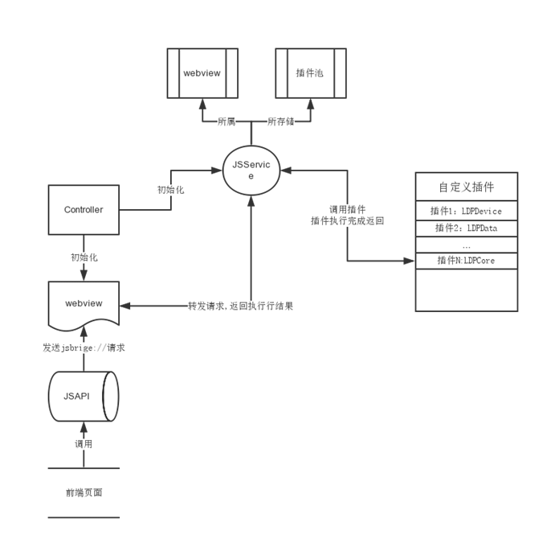

# LDJSBridge_IOS
===============

>**LDJSBridge_IOS**的核心目标是完成在IOS客户端中**WAP页面和客户端（Native）的深度交互**。 

## 如何集成LDJSBridge_IOS
-------------------

### Pod集成

>
强烈推荐采用Pod集成。具体方法如下：

1.  Clone线上repo仓库到本地 (第一次创建私有类库引用)

		pod repo add podspec https://git.ms.netease.com/commonlibraryios/podspec.git 
		pod repo update podspec
	
2. 在项目工程的Podfile文件中加载LDJSBridge库：

		pod 'LDJSBridge'

### 代码拷贝集成

>
如果没有私有库Pod访问权限（可以联系技术支持），也可以拷贝工程中[LDJSService文件夹](CommonJSAPI/LDJSService) 到你所在项目的工程文件夹中 进行代码集成；

## 基于LDJSBridge_IOS的插件运行机制

>
本LDJSBridge_IOS是基于Phonegap的Cordova引擎的基础上简化而来，其基本原理参照Cordova的引擎原理如图所示：

>
在Cordova的基础上我们进行了简化，通过JSAPIService服务的方式进行插件扩展开发如图所示：

## 如何开发基于LDJSBridge_IOS的Native插件
-------------------------------------

>
本工程主要是提供LDJSBridge_IOS的技术框架，方便各个客户端项目集成开发各自需要的JSAPI。一般各个项目根据产品和运营的WAP需求先制定JSAPI文档（规范参考：[这里](https://git.ms.netease.com/commonlibrary/LDJSBridge/blob/master/README.md)），
在工程中也提供了一部分[Demo示例](CommonJSAPI/Plugins)，可以下载整个工程运行查看；

### 定义某个模块插件

>
在Native部分，定义一个模块插件对应于创建一个插件类, 模块中的每个插件接口对应插件类中某个方法。
集成LDJSBridge_IOS框架之后，只需要继承框架中的插件基类LDJSPlugin，如下所示：

* 插件接口定义

		#import "LDJSPlugin.h"
		@interface LDPDevice : LDJSPlugin
		{}

		//@func 获取设备信息
		- (void)getDeviceInfo:(LDJSInvokedUrlCommand*)command;
		
		@end
	
* LDJSPlugin 属性方法说明

		@interface LDJSPlugin : NSObject {}
		
		//在插件初始化的时候，会初始化当前插件所属的webview和controller
		//供插件方法接口 返回处理结果
		@property (nonatomic, weak) UIWebView* webView;
		@property (nonatomic, weak) UIViewController* viewController;
		//执行回调函数的delegate
		@property (nonatomic, weak) id <LDJSCommandDelegate> commandDelegate;
		
		@end

* 自定义插件接口实现

		@implementation LDPDevice
		//@func 获取设备信息
		- (void)getDeviceInfo:(LDJSInvokedUrlCommand*)command{
			//从comment中获取参数，
			//arg参数（通过p参数传递的非JSONObject），
			//json参数 通过p传递的JSONObject
			//arg参数通过index获取，json对象参数通过key获取
			
		
    		//读取设备信息
    		NSMutableDictionary* deviceProperties = [NSMutableDictionary dictionaryWithCapacity:4];
    		UIDevice* device = [UIDevice currentDevice];
    		[deviceProperties setObject:[device systemName] forKey:@"systemName"];
    		[deviceProperties setObject:[device systemVersion] forKey:@"systemVersion"];
    		[deviceProperties setObject:[device model] forKey:@"model"];
    		[deviceProperties setObject:[device modelVersion] forKey:@"modelVersion"];
    		[deviceProperties setObject:[self uniqueAppInstanceIdentifier] forKey:@"identifier"];
    
    		//对接口方法获取的结果进行封装，message可以封装dic、array、strng、int等类型的数据
    		LDJSPluginResult* pluginResult = [LDJSPluginResult resultWithStatus:CDVCommandStatus_OK messageAsDictionary:[NSDictionary dictionaryWithDictionary:deviceProperties]];
    
    		//通过delegate将结果 传回 webview进行处理
    		[self.commandDelegate sendPluginResult:pluginResult callbackId:command.callbackId];
		}
>
 *tip:*
 具体项目的的插件开发最好按照JSAPI的文档有计划的开发。

## 如何在WebView页面使用自定义的插件
---------------------------------

>
 在IOS项目中，当展示WAP页面的时候会用到UIWebView组件，我们通过在UIWebView组件所在的Controller中注册JSAPIServie服务，拦截Webview的URL进行处理。
 
 * 在Webview所在的Controller中初始化一个JSAPIService，并注册该WebView需要使用的插件
 
		-(void) viewDidLoad {
    		[super viewDidLoad];
    
    		....
    
	    	//创建webview
	    	[self createGapView];
        
		    //注册插件Service
    		if(_jsService == nil){
        		_jsService = [[LDJSService alloc] initWithWebView:_webview];
    		}
    

    		//批量测试
			//NSDictionary *pluginsDic = [NSDictionary dictionaryWithObjects:ARR_PLUGINS_CLASS forKeys:ARR_PLUGINS_KEY];
			//[_jsService registerPlugins:pluginsDic];
			//[_jsService unRegisterAllPlugins];
    
		    //单个注册测试, 
		    //device是js调用namespace名称， 
			//LDPDevice 是Natvie插件的Class名称
    		[_jsService registerPlugin:@"device" withPluginClass:@"LDPDevice"];
		    [_jsService registerPlugin:@"app" withPluginClass:@"LDPAppInfo"];
    		[_jsService registerPlugin:@"nav" withPluginClass:@"LDPUINavCtrl"];
		    [_jsService registerPlugin:@"ui" withPluginClass:@"LDPUIGlobalCtrl"];
		  	
		  	 ....
		    
		  }

* 通过WebviewDelegate拦截url请求，处理JSAPI中发送的jsbridge://请求

		- (BOOL)webView:(UIWebView*)theWebView shouldStartLoadWithRequest:(NSURLRequest*)request navigationType:(UIWebViewNavigationType)navigationType
		{
			//拦截JSBridge命令
			if([[url scheme] isEqualToString:@"jsbridge"]){
        		[_jsService handleURLFromWebview:[url absoluteString]];
        		return NO;
    		}
    		
    		....

		｝
 

## 定义NavigationController导航的Wap功能模块
-------------------------------------------

>
在手机qq里可以看到很多独立的基于WAP页面的功能模块，其实基于JSBridge的JSAPI最大的用处是以这种方式呈现。

* 目前在demo工程中已经初步完成了Device、App、UI导航部分的示例（参看[LDPBaseWebViewCrtl.m 文件](CommonJSAPI/LDPBaseWebViewCrtl.m)），客户端可以在此基础上根据项目需求进行完善开发：

>
		

## 技术支持
-------------------

>
to be continued ....

庞辉, 电商技术中心，popo：__huipang@corp.netease.com__
